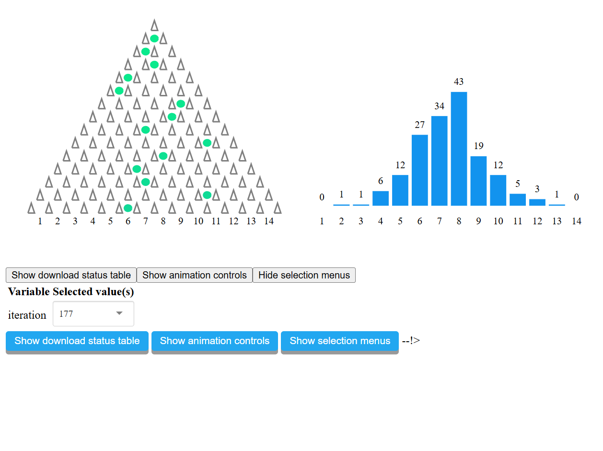
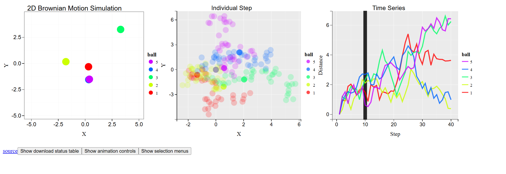
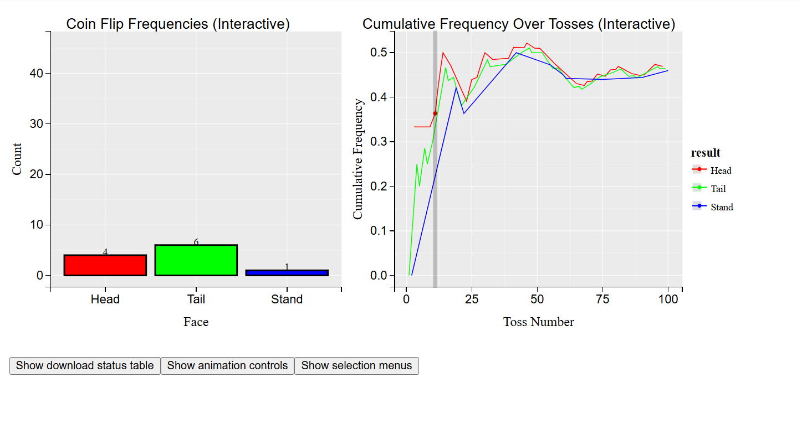
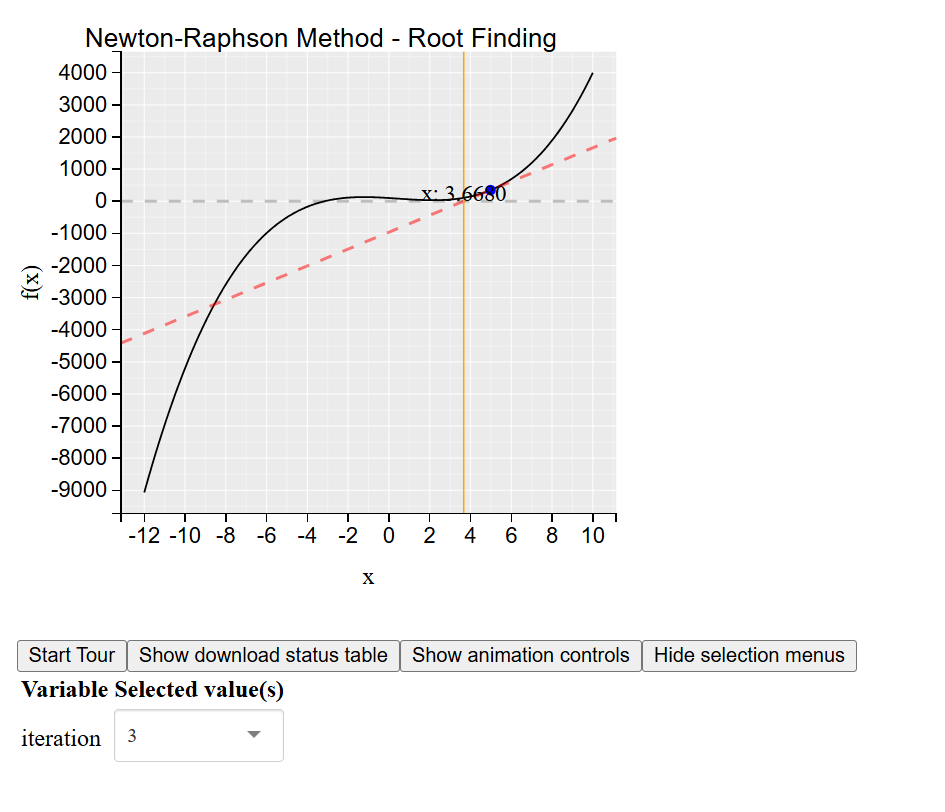
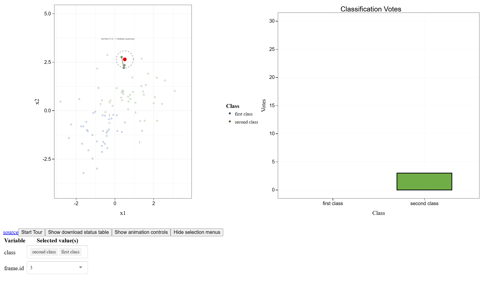
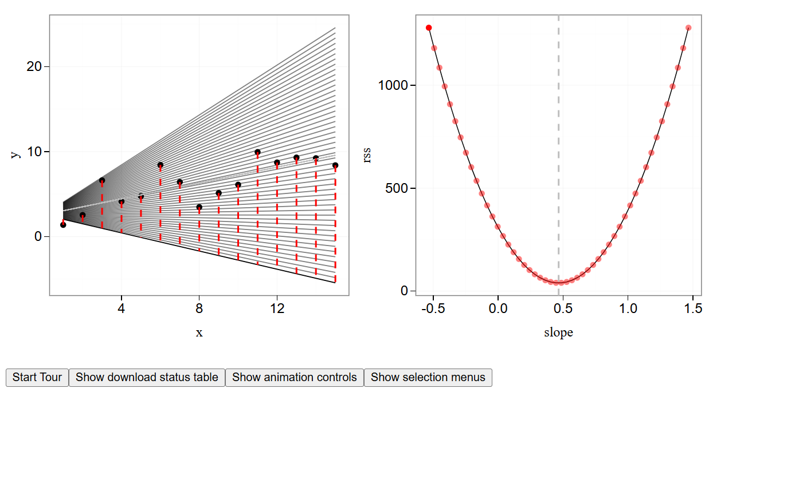
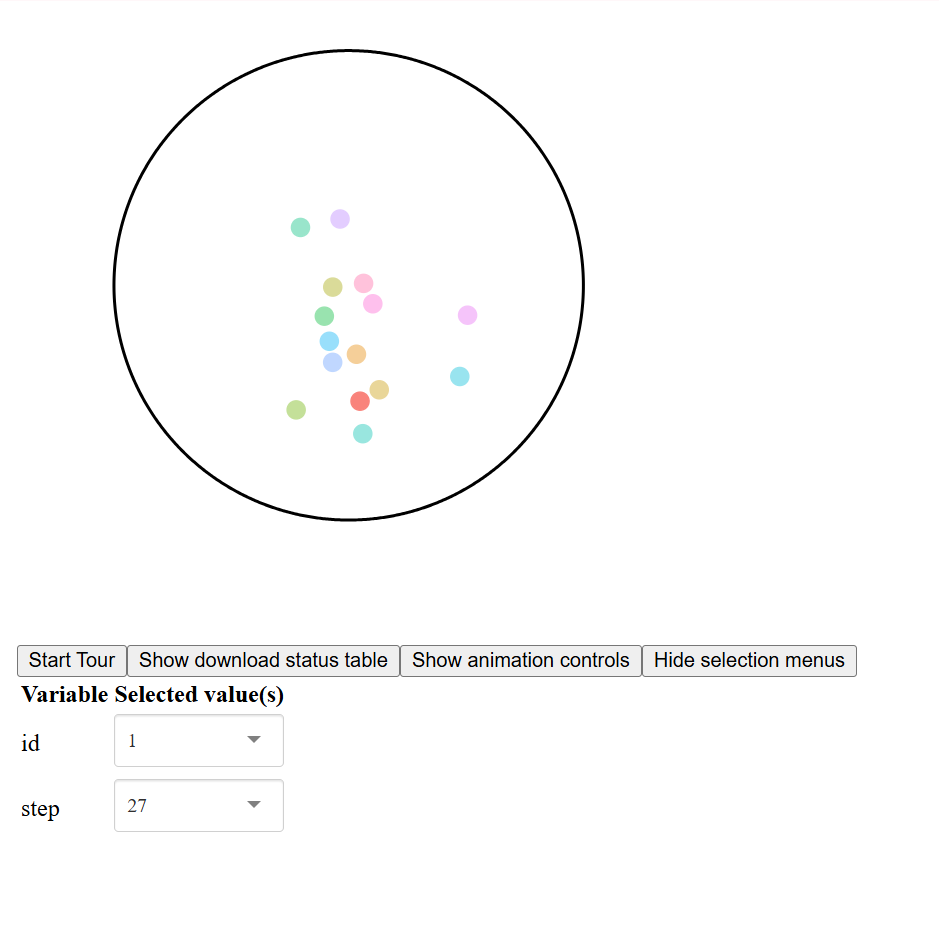

## Statistical Animation Examples Ported to Animint

---

### Gradient Descent
By Jun Cai  
[View Viz](http://bl.ocks.org/caijun/raw/de9e0af9f5ce2ca3fb43/) | [Source](https://github.com/caijun/AnimintTest/blob/master/test.medium.R) | [Original Animation](https://yihui.org/animation/example/grad-desc/)

---

### Lilac Chaser
By Faizan Uddin Fahad Khan  
[View Viz](http://bl.ocks.org/faizan-khan-iit/raw/2a6fa9c6c93c8fd752b9/) | [Source](https://github.com/faizan-khan-iit/gsoc_animint/blob/master/R/med_vi_lilac_chaser.R) | [Original Animation](https://yihui.org/animation/example/vi-lilac.chaser/)

---

### Frequency of Prices
By Anshul Goel  
[View Viz](http://bl.ocks.org/anshul96go/raw/95fa5e754080e956f4945942450c9f3e/) | [Source](https://github.com/anshul96go/R_animint2_GSOC/blob/master/medium_edited_final.Rmd) | [Original Animation](https://yihui.name/animation/example/price-ani/)

---

### Hit or Miss Monte Carlo Integration
By Himanshu Singh  
[View Viz](http://bl.ocks.org/lazycipher/raw/e7c45c7ce62808e32cce77262843827c/) | [Source](https://github.com/lazycipher/Tests-for-Animated-interactive-ggplots/blob/master/MediumTask.R) | [Original Animation](https://yihui.org/animation/example/mc-hitormiss/)

---

### Demonstration of the Galton Box

By Shubham Mittal  
[View Viz](https://shubhammittal588.github.io/Shubham-Mittal-GSoC/Galton_box/index2.html) | [Source](https://github.com/shubhammittal588/Animated_interactive_ggplots_GSoC_Tasks/blob/main/galton_box_final.R) | [Original Animation](https://yihui.org/animation/example/quincunx/)

---

### The Law of Large Numbers
By J. Chen  
[View Viz](https://gsoc.joss.cat/#fn_lln-in-action) | [Source](https://github.com/ampurr/gsoc/blob/main/fn_lln.R) | [Original Animation](https://yihui.org/animation/example/lln-ani/)

---

### Demonstration of Brownian Motion

By Vatsal Rajput  
[View Viz](https://vatsal-rajput.github.io/BrownianMotion/) | [Source](https://github.com/Vatsal-Rajput/Animint2Test) | [Original Animation](https://yihui.org/animation/example/brownian-motion/)

---

### Sample Mean Monte Carlo Integration
By Tushar Banik  
[View Viz](https://tushar98644.github.io/Animint2_Tests/monte-carlo-integration/index.html) | [Source](https://github.com/Tushar98644/Animint2_Tests) | [Original Animation](https://yihui.org/animation/example/mc-samplemean/)

---

### Probability in Flipping Coins

By Tarun Choudhary  
[View Viz](https://busttech.github.io/deploy2/) | [Source](https://github.com/busttech/Test-solutions-of-animint/blob/main/Medium-test-solution/main.r) | [Original Animation](https://yihui.org/animation/example/flip-coin)

---

### Newton-Raphson Method for Root-Finding

By Suhaani Agarwal  
[View Viz](https://suhaani-agarwal.github.io/r/newton_raphson_method/index.html) | [Source](https://github.com/suhaani-agarwal/r/tree/main/medium_test_newtons_method_code/newtons_root.r) | [Original Animation](https://yihui.org/animation/example/newton-method/)

---

### k-Nearest Neighbour (kNN) Classification

By Aryan Singh  
[View Viz](https://Aryan-SINGH-GIT.github.io/knn-animint) | [Source](https://github.com/Aryan-SINGH-GIT/animated-interactive-ggplots/blob/master/02_animint2_interactions/knn_animint.R) | [Original Animation](https://yihui.org/animation/example/knn-ani/)

---

### Buffon's Needle Simulation
By Aakriti Kushwaha  
[View Viz](https://aakritixyz.github.io/buffon-needle-animint-test/) | [Source](https://github.com/aakritixyz/buffon-needle-test) | [Original Animation](https://yihui.org/animation/example/buffon-needle/)

---

### Least Squares Method

By Aviral Sapra  
[View Viz](https://aviral0013.github.io/least-squares-animint/) | [Source](https://github.com/AviraL0013/least-squares-animint/blob/main/source/least_squares_animint.R) | [Original Animation](https://yihui.org/animation/example/least-squares/)

---

### Brownian Motion in a Circle

By Prateek Kalwar  
[View Viz](https://prateek-kalwar-95.github.io/brownian_motion_in_Circle/) | [Source](https://github.com/prateek-kalwar-95/brownian_motion_in_Circle/blob/main/Brownian.R) | [Original Animation](https://yihui.org/animation/example/bm-circle/)

---

**Total:** 14 Visualizations (7 with screenshots)

